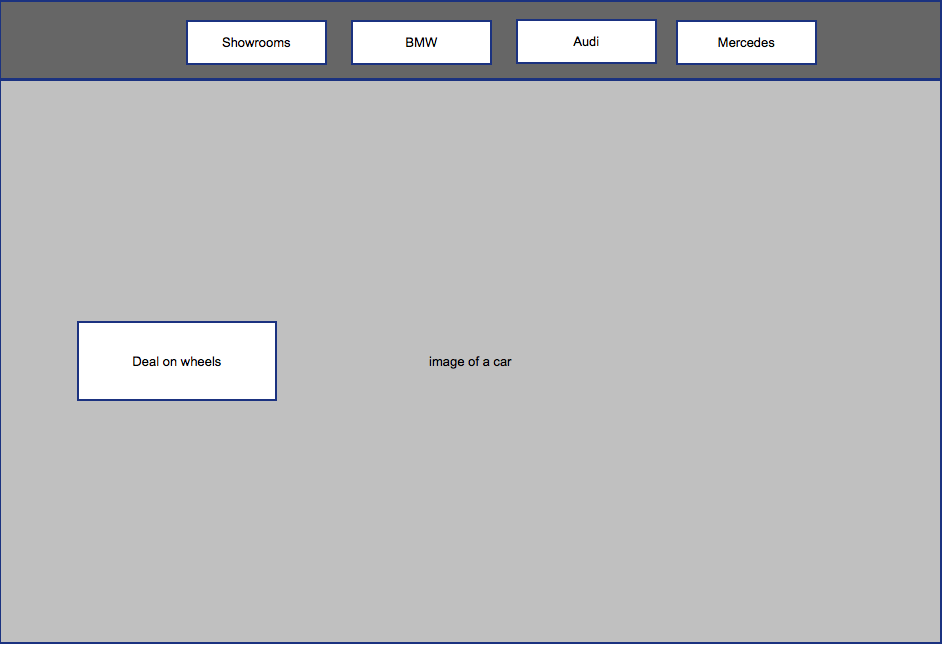
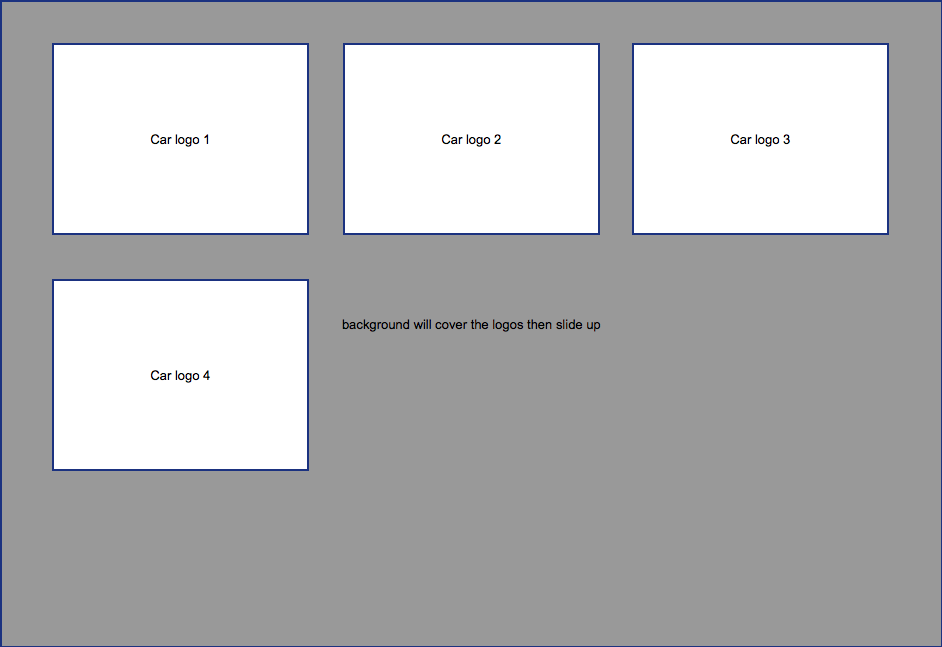
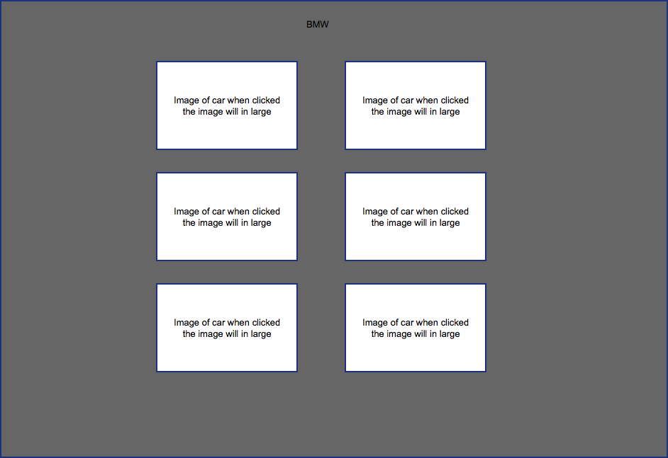
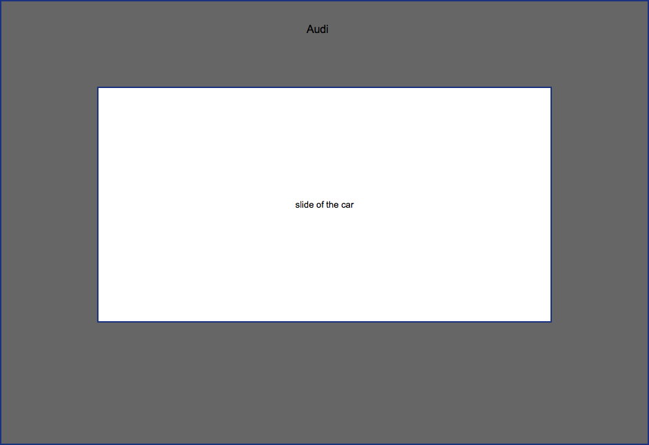
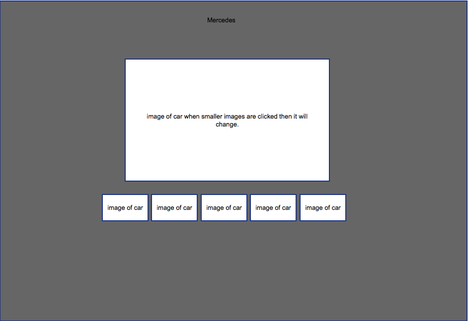

## Front End Web Development
## Introduction

This website is a car showroom webiste, which allows the users to look at diffrent cars which are reasonably priced and overpriced, it is also a single page website. The three car showrooms which are displayed on the website are BMW, Mercedes and Audi. The concept of this website was for me to show my father on what car i should buy, I added some cars which overpriced as well so that the cars which he would look at are the ones i would want. For other users they can also choose to do the same aand have a look at the cars which are reasonably priced.

## Design

The design of the website is very simple and easy to uderstand and navigate through as there are three ways to get to any of the sections of the page they are scrolling, the navbar and the garage section.

The first part is the main section of the website, this includes the navbar that moves while scrolling and a nice image of a car as the background. I placed the name of the Deal on Wheels next to the image of the car this is also a button when pressed it would smooth scoll down the next section of the page. Between the first section and second section the garage i have inserted javascript that will allows the second section to cover the first secion.


The garage section of the website hides the showrooms whihc are further below, when the button Deals on Wheels is clicked and it smooth scrols down the image of the garage slides up as if its opening up. Underneath the garage image there are three logos with a hover effect which also allows you to go to their sections and shows you which showroom you are hovering over.


The third section is the BMW section which is the first showroom, this section shows all six images of the cars which i choose and they are in a article which is used to have them placed in the grid like formation, I then procceded to set them closely with padding. when the images are clicked on they enlarge so the user can have a better look at the car. In my case so that my dad could see the images better. below the images is a table with all hte car names, short description and their prices.


The fourth section is the Audi section in this section i created a slideshow with the images of the cars, in my first design i was going to just insert the images on the page similar to the BMW section.


The fifth section is the mercedes section in this section is a image slider which when the small images are clicked on the big container changed into that image and has a nice pulsing effect as well.


Finally the footer has my copy right icon and my name and links to my instagram, twitter and facebook which i can add but did not, so it just returns to the top of the page.


##Compatibility Testing
| Devices       | Yes/No        |
| ------------- |:-------------:|
| PC            | Yes           |
| Laptop        | Yes           |
| Tablet        | Yes           |
| Phone         | Yes           |

##Browser Testing
| Browsers       | Yes/No       |
| ------------- |:-------------:|
| Google Chrome | Yes           |
| Firefox       | Yes           |
| Safari        | Yes           |
| Opera         | Yes           |

##Improvements
I would improve the Mercedes section so that its responsive so that it it shrinks with the page. I would also change the garage section so that the container would shrink so that it does not overflow when it shrinks.

validate html 


## Example code

HTML-
```html
<article>
 <a href="img/bmw/bmw12.jpg" class="image"></a>
 </article>
```
This code from the HTML is from the BMW section which allows the image to be seen and when clicked the image enlarges.

CSS-
```css
.slider {
    width: 640px;
    position: relative;
    padding-top: 320px;
    margin: 100px auto;
    box-shadow: 0 10px 20px -5px rgba(0, 0, 0, 0.75);
    margin: 0 auto;
}
```
This code for the css us for the slider on the Mercedes section this shows the width of the image and the images of the small iamges are the same width. padding-top allows the lables to come down underneath the big image. The shadow effect gives the effect of the image standing out of the background.
 
Javascript-
```javascript
$('.hov').hover(function() {
        $("#image1").slideUp(1000);
         if page reload it will return
        $.doTimeout(300, function() {
            hideClosedSearchLink();
            showHomeSearch();
        });
        $(this).unbind('mouseenter mouseleave')
    });
});
```
This javascript code slides the image up when hovered over the image will slide up and after it has disappeared it does not reapear after that.


## Reference

Tools used:

Sublime text- The text editor i used for my website.

Haroopad- I used this to make my readme.md file and it helped me with inserting the images into the file and setting it out in a nice layout.

Pencil project- I used this to desgin the sketchs of the website.

Frameworks used:

jquery- Used jquery to hide and show the garage in my website and for my website to smooth scroll when the deals on wheels button is clicked.

bootstrap- Used this to make the website responsive.

